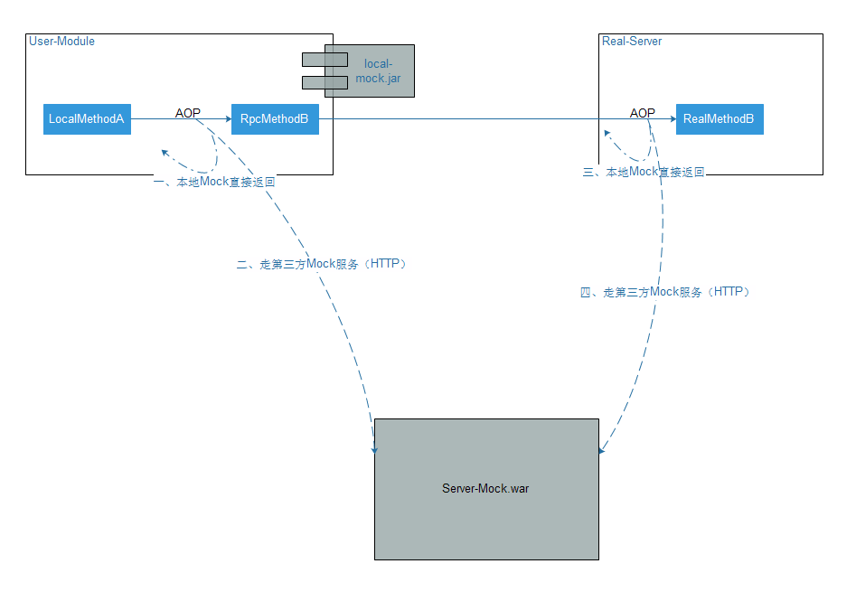

# Tiny-Mock

# 简介
tiny-mock是一个轻量mock框架，主要为了实现mock与真实代码解耦。

# 特性
tiny-mock 分本地mock（local-mock）和服务mock（server-mock）。
如果只为了在调用某一个接口时，不走真实逻辑，而走本地的mock分支的话，使用local-mock就能够满足你的要求。
如果想在调用某一个接口时，不走真实逻辑，而去调用一个第三方的mock服务的话，那么就要使用local-mock配合server-mock一起使用，就能够达到目的。

* local-mock 提供本地mock的轻量实现
* server-mock 提供服务mock的轻量实现
* mock支持注解和xml配置两种方式，可以随意选择

## I. local-mock
提供了三种注解：@MockReturn、@MockBy、@MockByHttp。
其中也对应了三种xml配置MockReturnXmlItem、MockByXmlItem、MockByHttpXmlItem

### 1. @MockReturn（MockReturnXmlItem）
使用在真实接口上，调用真实接口时，直接使用用户指定的值返回。
**特定值：**
```
	String THROW = "THROW()"; // 抛出一个异常
    String RANDOM = "RANDOM()"; // 返回一个随机对象
    String RANDOM_EXCEPTION = "RANDOM_EXCEPTION()"; // 返回随机对象或抛出一个异常
```

```
	/**
	 * 含有@MockReturn的方法，将直接返回value
	 * @author Created by wzy on 2017/6/1.
	 */
	@Target({METHOD})
	@Retention(RUNTIME)
	public @interface MockReturn {
	    /**
	     * mock的返回值。复杂对象使用JSON串作为返回值
	     * @see MockAspect
	     */
	    String value();
	
	    String THROW = "THROW()"; // 抛出一个异常
	    String RANDOM = "RANDOM()"; // 返回一个随机对象
	    String RANDOM_EXCEPTION = "RANDOM_EXCEPTION()"; // 返回随机对象或抛出一个异常
	}
```


### 2. @MockBy（MockByXmlItem）
使用在真实接口上，通过第三个类来代理执行真实逻辑，然后返回。
```
	/**
	 * 含有@MockBy注解的方法，将使用useClass中的useMethod方法的返回值来返回 
	 * @author Created by wzy on 2017/6/1.
	 */
	@Target({ METHOD })
	@Retention(RUNTIME)
	public @interface MockBy {
		/**
		 * useClass : 用于mock的class
		 */
		Class<?> useClass();
	
		/**
		 * 用于mock的method名字。
		 */
		String useMethod();
	
		/**
		 * 是否将真实方法的参数往mock方法中传递，默认false
		 */
		boolean passParameter() default false;
	}
```

### 3. @MockByHttp（MockByHttpXmlItem）
使用第三方Mock服务来代理执行真实逻辑，然后返回mock的结果。
为了设计的轻量和对异构系统的支持友好，这里使用了http的方式来调用第三方mock服务。（可以配合mock-server一起使用，也可以自开发mock-server）
```
	/**
	 * 使用http接口来mock，实现mock服务，解耦mock
	 * @author Created by wzy on 2017/6/20.
	 */
	@Target({ METHOD })
	@Retention(RUNTIME)
	public @interface MockByHttp {
		/**
		 * http url。默认使用mock/class/method?params=xxx
		 * @return
		 */
		String serverPath() default "";
	}
```

## II. server-mock
接收local-client发送过来的mock请求，并分发到相应的mock请求处理类，进行处理，然后返回mock的执行结果。
默认是将local-client的mock请求路由到http://xxx.xxx.xxx:xx/mock/class/method?params=xxx
当然，也可以指定路由地址。
server-mock采用Spring MVC搭建，配合Tomcat一起部署。
### 构想
* 后面会增加server-mock返回异常给local-mock
* 未来可以开发server-mock的配置页面，通过页面来配置mock服务，减少开发量，更加方便

# 设计图



# Quick Start
可以参考local-mock里面的test类：MockByTest.java、MockReturnTest.java、MockByHttpTest.java
**MockReturn eg:**
```
// 注解形式
	@MockReturn("mock_123")
	public String method_2() {
		System.out.println("执行真实方法：method_2");
		return "do method_2------[real method methodA_2]";
	}
	
	@MockReturn(MockReturn.RANDOM)
	public Foo method_9() {
		Foo foo = new Foo();
		foo.setId(1);
		foo.setName("真实Name");
		foo.setNo("真实No");
		System.out.println("执行真实方法：method_9");
		return foo;
	}
	
// 配置形式 （具体参考src/test/resources/beans/beans-mock.xml）
	<bean class="com.cn.kvn.mock.local.config_mock.MockReturnXmlItem"
	p:mockedClass="com.cn.kvn.mock.local.test.ServiceA"
	p:mockedMethodName="method_12" p:returnValue="RANDOM()" scope="prototype" />
```

**MockBy eg:**
```
// 注解形式
	@MockBy(useClass = MockServiceA.class, useMethod = "mockMethod_4")
	public String method_4() {
		System.out.println("执行真实方法：method_4");
		return "do method_4------[real method methodA_4]";
	}

// 配置形式 （具体参考src/test/resources/beans/beans-mock.xml）
	<bean
	class="com.cn.kvn.mock.local.config_mock.MockByXmlItem"
	p:mockedClass="com.cn.kvn.mock.local.test.ServiceA"
	p:mockedMethodName="method_14"
	p:delegateClass="com.cn.kvn.mock.local.test.MockServiceA"
	p:delegateMethodName="mockMethod_14" p:passParameter="true" scope="prototype" />
	
```

**MockByHttp eg:**
```
// 注解形式
	@MockByHttp
	public String method_15(){
		System.out.println("执行真实方法：method_15");
		return "do method_15------[real method method_15]";
	}

// 配置形式 （具体参考src/test/resources/beans/beans-mock.xml）
	<bean class="com.cn.kvn.mock.local.config_mock.MockByHttpXmlItem"
	p:mockedClass="com.cn.kvn.mock.local.test.ServiceA"
	p:mockedMethodName="method_17"/>
```